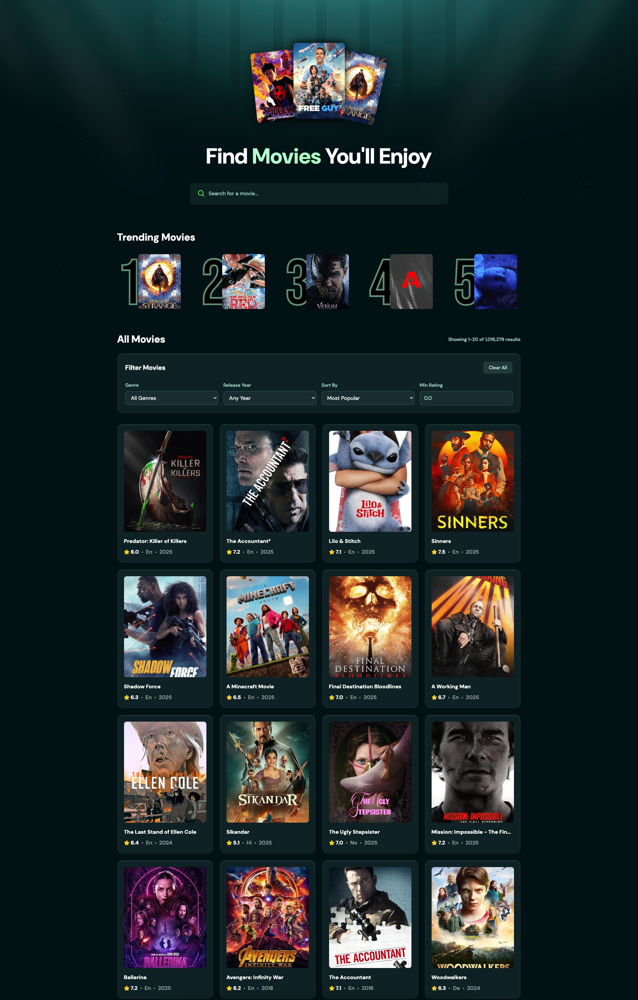

# Movlix

> A modern movie discovery app built with React, featuring advanced filtering, pagination, and real-time trending analytics powered by The Movie Database (TMDB) API and Appwrite.




## Features

- **Smart Search**: Debounced real-time search with optimized API calls
- **Advanced Filtering**: Filter by genre, release year, rating, and sort options
- **Intelligent Pagination**: Smooth navigation with smart scroll positioning
- **Real-time Analytics**: Dynamic trending section based on user search patterns
- **Movie Details**: Rich modals with cast, budget, and production information
- **Responsive Design**: Mobile-first approach with CSS Grid layouts

## Tech Stack

- **Frontend**: React 19, Vite, TailwindCSS
- **Backend**: Appwrite (real-time database)
- **API**: The Movie Database (TMDB)
- **Utilities**: react-use (debouncing)

## Getting Started

### Prerequisites

- Node.js (18+)
- pnpm (recommended) or npm

### Installation

1. Clone the repository

```bash
git clone https://github.com/yourusername/movieflex.git
cd movieflex
```

2. Install dependencies

```bash
pnpm install
```

3. Set up environment variables

```bash
cp .env.example .env
```

Add your API keys:

```env
VITE_TMDB_API_KEY=your_tmdb_api_key
VITE_APPWRITE_PROJECT_ID=your_appwrite_project_id
VITE_APPWRITE_DATABASE_ID=your_database_id
VITE_APPWRITE_COLLECTION_ID=your_collection_id
```

4. Run the development server

```bash
pnpm dev
```

## Project Structure

```
src/
├── components/          # Reusable UI components
│   ├── Filter.jsx      # Filtering system
│   ├── MovieCard.jsx   # Movie display component
│   ├── MovieModal.jsx  # Detailed movie view
│   ├── Pagination.jsx  # Navigation component
│   └── Search.jsx      # Search functionality
├── app/                # Application logic
├── assets/             # Static assets
└── App.jsx            # Main application component
```

## Key Features Implementation

### Search Debouncing

Implements 500ms debouncing to reduce API calls by ~80% while maintaining responsive search experience.

### Dynamic Filtering

Switches between TMDB's search and discover endpoints based on user input, applying filters intelligently.

### Real-time Analytics

Tracks search patterns using Appwrite to generate dynamic trending content based on user behavior.

## Acknowledgments

- [The Movie Database (TMDB)](https://www.themoviedb.org/) for providing the movie data API
- [Appwrite](https://appwrite.io/) for backend services
- Built as a learning project to explore modern React patterns

---

📖 **[See detailed project showcase and technical deep-dive →](https://zg0ul.com/projects/movlix)**
